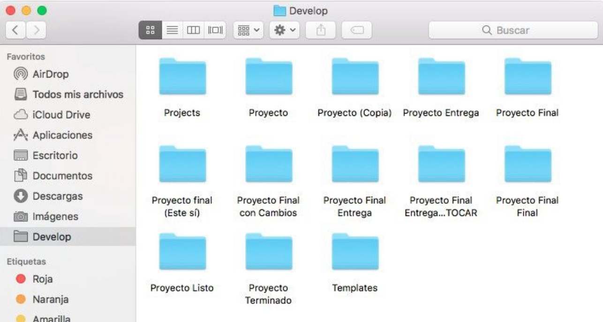
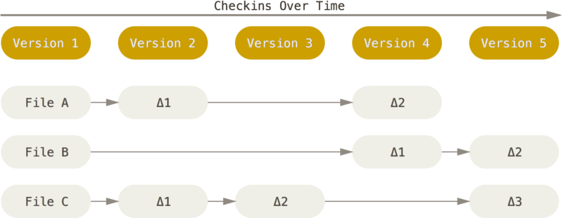
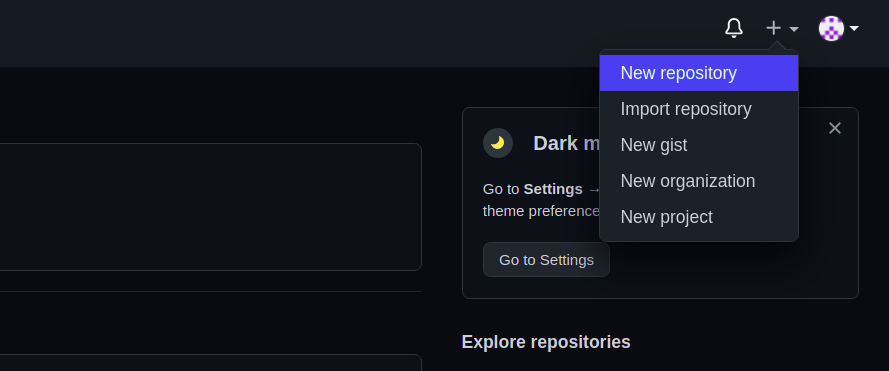
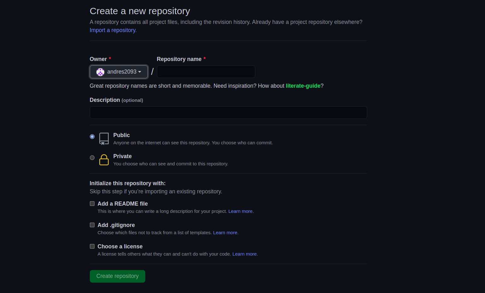

# Ej. 01 - Creación de estructura de proyecto

## REQUISITOS
- Tener Git Bash si usas Windows.
- Tener una cuenta en GitHub.

## INSTRUCCIONES

1. Abrir la terminal (tener en cuenta que la interfaz puede cambiar dependiendo
   del sistema operativo que tengas).

2. Por defecto, cuando abrimos la terminal esta se ubica en el directorio
   principal (_home_) de nuestra computadora. Podemos verificar cuál es dicho
   directorio escribiendo el comando `pwd` (abreviación de "present working directory").

   ```bash
   $ pwd # Present Working Directory
   /Users/bedu
   ```

3. Una vez que sepas en donde te encuentras probablemente quieras ir a alguna
   otra ubicación para crear la carpeta del proyecto. Digamos que queremos
   crearlo dentro de la carpeta _Documents_ (el nombre puede variar dependiendo
   del sistema operativo). El comando que nos permite acceder o movernos de
   ubicación es `cd` (abreviación de "change directory"). A diferencia del comando anterior, éste es precedido por
   el nombre del directorio al que nos queremos mover.

   ```bash
   $ cd Documents # "Change Directory" a Documents
   ```

   > TIP: Si quieres verificar que realmente se haya cambiado de ubicación,
   > puedes usar el comando anterior para comprobarlo:
   >
   > ```bash
   > $ pwd
   > /Users/bedu/Documents
   > ```

4. Ahora que ya te encuentras donde deseas crear tu proyecto, es momento de
   crear un directorio donde almacenarás todos los archivos que terminarás
   utilizando. Para crear dicho directorio puedes usar el comando `mkdir` (abreviación de "make directory"). Al
   igual que `cd`, este comando necesita que le indiques el nombre del
   directorio que deseas crear.

   ```bash
   $ mkdir matcha # Make Directory "matcha"
   ```

5. El comando que acabas de ejecutar, ha creado una carpeta llamada `matcha`,
   una forma de verificar si se ha creado es listando todo lo que se encuentra
   en la ubicación actual. Para esto, usa el comando `ls` (abreviación de "list").

   ```bash
   $ ls # List
   matcha   another-directory    some-file.txt
   ```

   > TIP: Dependiendo de la configuración de tu terminal, puede que te muestre
   > las carpetas con un formato diferente al de los archivos, en caso contrario,
   > lo puedes diferenciar debido a que la mayoría de archivos contienen un
   > punto (`.`) seguido de la extensión (nombre particular, ejemplo: txt, doc,
   > xls, etc) mientras que los directorios no.

6. Git

   Control de versiones que registra los cambios realizados en nuestros archivos para recuperar
   versiones específicas


   

   **La historia de Git**

   Git comenzó un poco de la destrucción creativa y una gran polémica.

   En el 2005 la comunidad encargada del desarrollo del Kernel Linux usaba la herramienta DVCS de Bitkeeper pero esta relación dejó de funcionar al dejar de estar disponible esta herramienta de forma gratuita. Esto impulsó a la comunidad y en particular a <a href="https://www.youtube.com/watch?v=iNFtX2ctExM" target="_blank">Linux Torvalds</a> **(video: Torvalds explica por qué hizo git)**, el creador de Linux a desarrollar su propia herramienta con los siguientes objetivos:

   - Velocidad
   - Diseño sencillo
   - Gran Soporte para desarrollo no lineal (Ramas)
   - Completamente distribuido
   - Capaz de manejar grandes proyectos

   **Fundamentos de Git**

   La principal diferencia entre Git y cualquier otro VCS (Versioning Control System) es la forma en la que manejan sus datos. Conceptualmente, la mayoría de los otros sistema almacenan la información como una **lista de cambios** en los archivos y las modificaciones hechas a cada una de ellos **a través del tiempo**.

   


   <a href="http://raulavila.com/2017/01/como-funciona-git-1/">Git, en cambio, maneja sus datos como un conjunto de copias instantáneas</a> **(articulo: Comó funciona el núcleo de Git)** de un sistema de archivos miniatura. Cada vez que confirmamos un **cambio o guardamos** el estado del proyecto, básicamente **toma una foto del aspecto de todos los archivos en ese momento y guarda una referencia a esa copia**. Para ser eficiente los archivos que no se han modificado Git no los almacena en el archivo nuevo, sino como un **enlace al archivo anterior idéntico** que ya se tiene almacenado.


   

7. Una vez comprobado que tu directorio se creó correctamente, accede a él
   (recuerda el comando `cd` para cambiar de ubicación y `pwd` para verificar).
   Una vez dentro, el comando para iniciar un proyecto de git es `git init`

   ```bash
   $ cd matcha # Change directory a "matcha"
   $ pwd # Present Working Directory
   /Users/bedu/Documents/matcha
   $ git init # Inicia un proyecto de Git "Vacío"
   ```

   1. Para crear archivos usamos `touch` seguido del nombre
   del archivo que deseas usar. Para este caso, crearemos solo uno llamado
   `index.html` (en este caso _.html_ es la extensión que usaremos).

   ```bash
   $ touch index.html # Crea archivo "index.html"
   $ ls # Lista contenido
   index.html
   ```

   2. Agregar archivos a Git (en la parte de Staging)

      - `git add [filename]` (Archivo por archivo)
      - `git add .` (Todos los modificados)

   3. Realizar commit con el comando `git commit -m “[Mensaje del commit]”`, seguido por la tecla enter. Por ejemplo: `git commit -m “Mi primer Commit en Git”`

      > TIP: Si nos muestra el siguiente mensaje
      > ```bash
      > *** Please tell me who you are
      >
      > Run
      >
      >  git config --global user.email 'you@email.com'
      >  git config --global user.name 'Your name'
      >
      > ...
      >```
      > Lo primero que debemos realizar es configurar la identidad, debemos establecer el nombre de usuario y dirección de correo electrónico.
      >
      > Esto es importante porque cada que realicemos un **“commit”** (Registro de cambio) Git usa esta información para registrar quien realizó este cambio.
      >
      > Para realizar esta acción debemos escribir la siguiente línea de código para establecer nuestro nombre de usuario:
      >
      > `git config --global user.name "Nombre de Usuario"`
      >
      > A continuación para establecer el correo electrónico que usaremos ingresamos la siguiente línea de código:
      >
      > `git config --global user.email "micorreo@example.com"`
      >
      > Ahora podremos realizar el commit.

   4. Crear un repositorio remoto usando GitHub

      

      

      Copia la url de tu repositorio

      

      Una vez copiada la url ejecuta los siguientes comandos

      `git remote add origin [url de tu repositorio]` -> Agregar remoto

      `git push -u origin master` -> Enviar commit al servidor por primera vez

      Revisa tus cambios de tu repositorio en github

      

¡Genial! Acabas de crear la estructura mínima de tu proyecto y tienes tu proyecto en
los servidores de GitHub, mediante comandos que insertaste en la terminal de tu computadora. Ahora tienes un mejor control sobre
ella y poco a poco te irás olvidando de tu _mouse_ o _touchpad_. Lo que acabas de crear debe
tener la estructura siguiente en las carpetas:

```text
Documents/
└── matcha/
    └── index.html
```

<br/>

[Siguiente](../Ejemplo%2002/README.md)