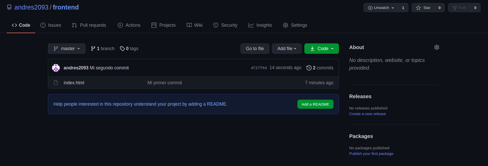

# Ej. 06 - Subiendo el proyecto a Github Pages
## Objetivos
1. Aprender a desplegar tu proyecto en internet usando el servicio gratutito de GitHub Pages.

---
 

## Requisitos
- Tener cuenta en github
- Tener Visual Studio Code instalado.

## Instrucciones

Vamos a respaldar esta versión de nuestro código en la nube. Para ello usaremos el servicio de GitHub, donde podemos "subir" a la nube todas las versiones que hagamos de nuestro proyecto. Necesitamos seguir un proceso para subir nuestro código de la manera correcta.
### 1. Agregar archivos modificados a la sección de git denominada "Staging"

- `git add [filename]` (Archivo por archivo)
- `git add .` (Todos los modificados)

 

### 2. Confirmaremos a git que esa versión ya puede entrar al registro de cambios con el comando `commit`

`git commit -m “[Mensaje del commit]”`, seguido por la tecla enter. Por ejemplo: `git commit -m “Actualizar cambios”`

 

### 3. Evniaremos los cambios a la nube en GitHub mediante el comando `push`

`git push origin master`, seguido por la tecla enter.

 

### 4. Revisa tus cambios en tu repositorio remoto en github y entra a la sección Settings

 

### 5. Haz clic en "Pages". Ahí, ubica la rama que quieres que se vea en internet y da clic en Save.

 

### 6. Te avisa que tu proyecto se publicó en GitHub Pages, y te da un vínculo. Copialo y pégalo en una nueva ventana de tu navegador. ¡Tu proyecto ya está en internet! ¡Compártelo con tus conocidos y familiares!

  

[Siguiente](../reto-06/README.md)