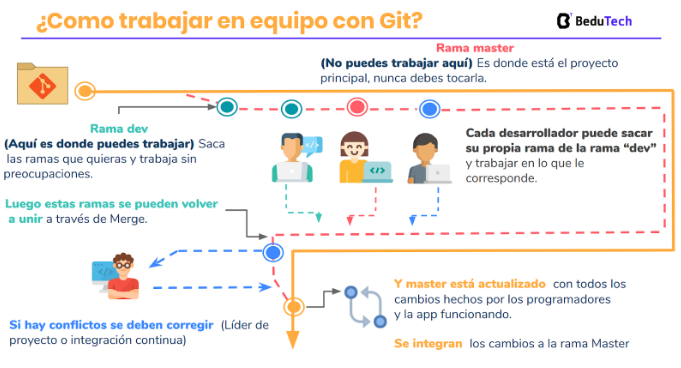
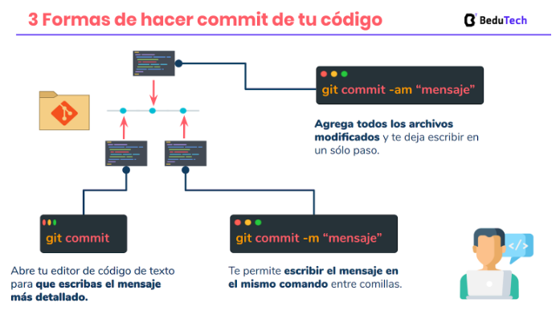

**Módulo..**

**POSTWORK**

Sesión 02

**Agregando la barra de navegación**

**Objetivo**

- Profundizar en unidades de medida en CSS.
- Entender mejor el trabajo con ramas en Git.

**⚙️ Setup**

A continuación te mostramos  las instalaciones necesarias para tu módulo:

**Editor de código.**

- [Visual Studio Code ](https://code.visualstudio.com/download)

**Versionamiento de código.**

- [Git](https://git-scm.com/downloads)
- Tener una cuenta de [GitHu](https://github.com/)b

### **Desarrollo**

En esta sesión viste cómo funciona el **modelo de caja**, de esta manera agregar los espacios internos y externos correctamente, además de tener en cuenta la diferencia entre los elementos con **display block** e **inline**.

📚 Objetivo 01. **Fuentes Google en tu proyecto.**

⏳ 15 minutos de lectura

De manera empírica vimos también cómo agregar fuentes externas en CSS, ahora a profundizar un poco más sobre las diversas formas de agregar fuentes personalizadas a nuestra página.

**🎞 Video 01.**  Incluir fuentes de Google Fonts en tu proyecto.

[Ve al video para aprender cómo insertar fuentes de Google Fonts](https://www.youtube.com/watch?v=scdBqnfP9qE)

 

📚 Objetivo 02. **Unidades de medidas absolutas y relativas.**

⏳ 15 minutos de lectura

Por otro lado, hemos ido usando unidades de medida absolutas y relativas en algunos casos.

**Ejemplo:**

El tamaño de letras o de margen las hemos expresado con **px** que son pixeles, mientras que en el ejercicio de hoy pusimos el ancho de las partes de la barra de navegación en **%** que es un porcentaje del tamaño de su contenedor.

**🎞 Video 02.**  Deja de usar píxeles y usa REM y EM.

Te dejamos un post que habla un poco al respecto de las unidades de medida en CSS y por qué se recomienda usar REM y EM en lugar de píxeles.

[Video explicativo sobre usar pixeles o rem](https://www.youtube.com/watch?v=Sgf4HEAW-gQ)
 

Si bien este video habla sobre por que es buena pŕactica usar REM y EM, para esta ocasión deseamos que el tema sea claro para ti y que no solo existen los **px** a pesar que serán los que más usemos de momento. Presta particular atención a las unidades **px**, **em**, **rem**, porcentaje (**%**) y revisa las propiedades **vw** y **vh**, ya que estas son las que normalmente usamos más seguido.

📚 Objetivo 03. **Uso de Git.**

⏳ 15 minutos de lectura

Por último, en este punto te habrás dado cuenta que desde el día uno, hemos estado usando **Git** y los comandos probablemente aún no te hacen sentido.

En la sesión de hoy vimos que podíamos crear ramas y que esto nos ayudaría a trabajar en equipo enviando [**Pull Requests**](https://git-scm.com/docs/git-request-pull) hacia nuestros compañeros.

Es normal que se te complique esto y la única manera que le vayas agarrando la onda es a través de la práctica.

Debido a esto, te dejamos dos tutoriales interactivos para que vayas jugando y aprendiendo que hace cada comando y arreglar típicos problemas en Git.

- [Learn Git Branching](https://learngitbranching.js.org/?locale=es_ES)
- [Oh My Git!](https://ohmygit.org/)

**Pro-tip:**

A continuación te mostramos algunos tips que puedes usar cuando trabajes en equipo usando Git.

**Pro-tip:**  En la siguiente imagen te mostramos 3 formas de como puedes hacer un commit en Git.

**Recursos adicionales.**

Si quieres profundizar en estos temas, puedes consultar los siguientes recursos.

- [Resources to learn Git](https://try.github.io/)
- [Katacoda](https://www.katacoda.com/courses/git)[(Learn Git Version Control using Interactive Browser-Based Scenarios)](https://www.katacoda.com/courses/git)**.**

---
 

✅ **Checklist**

Asegúrate que tu postwork contenga todo lo siguiente, ya que esto se evaluará al término del módulo. Recuerda que debes insertar a tu proyecto la imagen del sitio de Matcha que encuentras en este postwork.

|**Requisito**|**Sí lo cumple**|**No lo cumple**|
| :-: | :-: | :-: |
|A. Trata de resolver tres problemas de [Learn Git Branching](https://learngitbranching.js.org/?locale=es_ES).|||
|B. Escribe la diferencia entre px y rem como unidades de medida.|||
|C. Incluir dos fuentes de Google fonts en tu proyecto.|||

 

[Regresar](../README.md)

